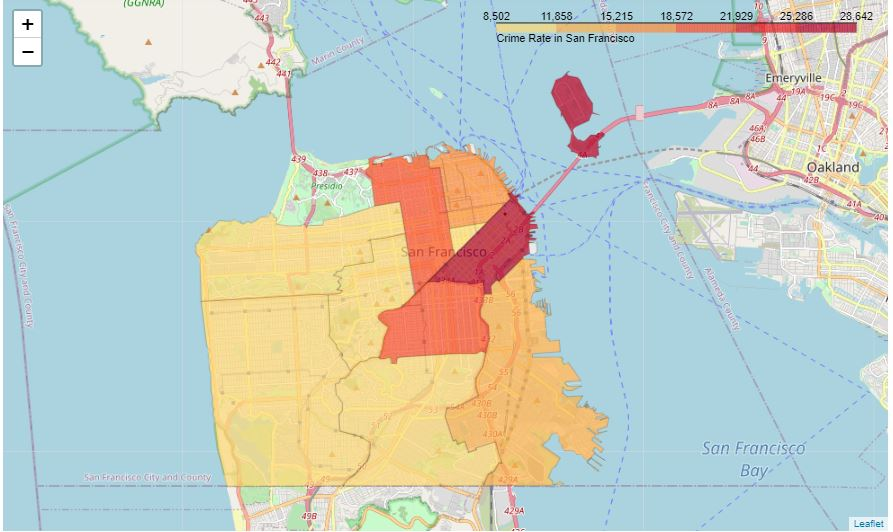

# Visualizing-Crime-in-San-Francisco

This project was done to fulfill course requirements for *Data Visualization using Python*. A Choropleth map is generated to visualize crime in San Francisco, by neighborhood.

### Libraries
* Pandas
* Folium
* Requests

### Output

